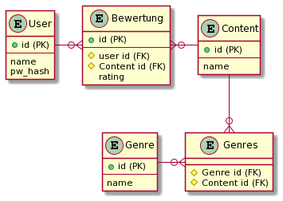
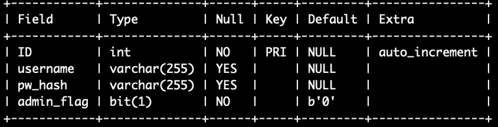
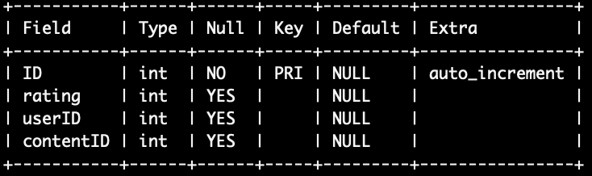
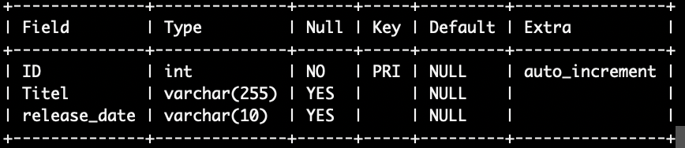
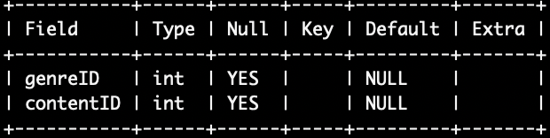
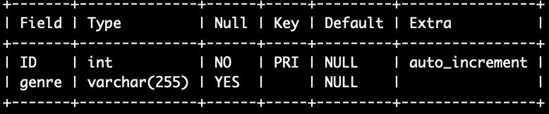

# __Dokumentation des Projektes für das Userbewertungsprojekt__

- [__Dokumentation des Projektes für das Userbewertungsprojekt__](#dokumentation-des-projektes-für-das-userbewertungsprojekt)
  - [__Projektbeschreibung__](#projektbeschreibung)
  - [__Datenbankentwurf__](#datenbankentwurf)
  - [__Übersicht Tabellen__](#übersicht-tabellen)
  - [__Überprüfung Normalform__](#überprüfung-normalform)
    - [Tabelle: _User_](#tabelle-user)
    - [Tabelle: _Bewertung_](#tabelle-bewertung)
    - [Tabelle: _Content_](#tabelle-content)
    - [Tabelle: _Genres_](#tabelle-genres)
    - [Tabelle: _Genre_](#tabelle-genre)
  - [__Überlegungen zur Datenintegrität__](#überlegungen-zur-datenintegrität)
  - [__SQL Befehle__](#sql-befehle)
    - [_Anzeige und Manipulation_](#anzeige-und-manipulation)
    - [_Erstellen von Tabllen_](#erstellen-von-tabllen)
  - [__Extra Features__](#extra-features)
    - [_Loginsystem_](#loginsystem)
    - [_Erweitertes Suchsystem_](#erweitertes-suchsystem)
  

---

## __Projektbeschreibung__

---

Ansprechpartner: Jan, Gianluca, Marius

Zeitraum: 24.11.2021 - 19.01.2022

Das von uns gestartete Projekt zielt darauf ab, eine Website zu verfügung zu stellen auf welcher es dem Nutzer möglich ist, sowohl alte als auch neue Filmen zu suchen und zu bewerten. 
Die Nutzerdaten und Filminformationen werden in einer Datenbank gespeichert.
Die Website richtet sich nicht nur an junge Leute sondern auch an ältere, welche sich wieder jung fühlen können, wenn sie die Filme aus ihrer Jugend wiederfinden.
Die Gui soll simpel und leicht zu bedienen sein, so das es möglich ist ohne viel Kopfschmerzen sich auf der Seite zurechtzufinden.

---

## __Datenbankentwurf__

---

Im nachfolgendem Bild ist das Entiy-Relationship-Diagramm zusehen, welches uns als Entwurf der Datenbank diente. 



---

## __Übersicht Tabellen__

----

_Relationsschreibweise_:

1. User(__Bewertung__, Name, PW-Hash, Admin flag)

2. Bewertung(__ID__, ↑User-ID, ↑Content-Id, Rating)

3. Content(__ID__, Name, Release date)

4. Genres(↑Genre-ID, ↑Content-ID)

5. Genre(__ID__, Genre)


--- 

## __Überprüfung Normalform__

--- 

###  Tabelle: _User_



- Die Tabelle ist in der dritten Normalform
  - zweite Normalform erfüllt
  - beinhaltet keine abhänigkeit zwischen   Nichtschlüsselattributen

    --- 

###  Tabelle: _Bewertung_



- Die Tabelle ist in der dritten Normalform
  - zweite Normalform erfüllt
  - beinhaltet keine abhänigkeit zwischen Nichtschlüsselattributen
  
    --- 

###  Tabelle: _Content_



- Die Tabelle ist in der dritten Normalform
  - zweite Normalform erfüllt
  - beinhaltet keine abhänigkeit zwischen Nichtschlüsselattributen
    
    --- 

###  Tabelle: _Genres_



- Die Tabelle ist in der dritten Normalform
- zweite Normalform erfüllt
  - beinhaltet keine abhänigkeit zwischen Nichtschlüsselattributen

    --- 

###  Tabelle: _Genre_



- Die Tabelle ist in der dritten Normalform
- zweite Normalform erfüllt
  - beinhaltet keine abhänigkeit zwischen Nichtschlüsselattributen

 --- 

## __Überlegungen zur Datenintegrität__

---

- Beim Löschen des Useraccounts werden seine getätigten Bewertungen mitgelöscht

---

## __SQL Befehle__

---

### _Anzeige und Manipulation_

Es folgen nun die SQL-Befehle, welche wir für die Manipulation und zum Anzeigen einzelner Datensätze benutzt habe.

```
Manipulation:

    'INSERT INTO users (username, pw_hash) 
     VALUES (%s, %s)', (username, password,)
  
     INSERT INTO content (Titel) 
     VALUES ("Geostorm");

Anzeige:

    'SELECT * 
     FROM users 
     WHERE username = %s', (username,)

    'SELECT * 
     FROM users 
     WHERE username=%s AND pw_hash=%s', (username, password)

```


### _Erstellen von Tabllen_

```

     CREATE TABLE IF NOT EXISTS ratings (
     ID INT NOT NULL AUTO_INCREMENT PRIMARY KEY,
     rating INT,
     userID INT,
     contentID INT
     );

     CREATE TABLE IF NOT EXISTS genre (
     ID INT NOT NULL AUTO_INCREMENT PRIMARY KEY,
     genre VARCHAR(255)
     );

```

---

## __Extra Features__

--- 

### _Loginsystem_
  - User können sich registrieren

    ---

### _Erweitertes Suchsystem_
  - Ermöglicht das Suchen nach spezifischen Kriterien
 
---
    

